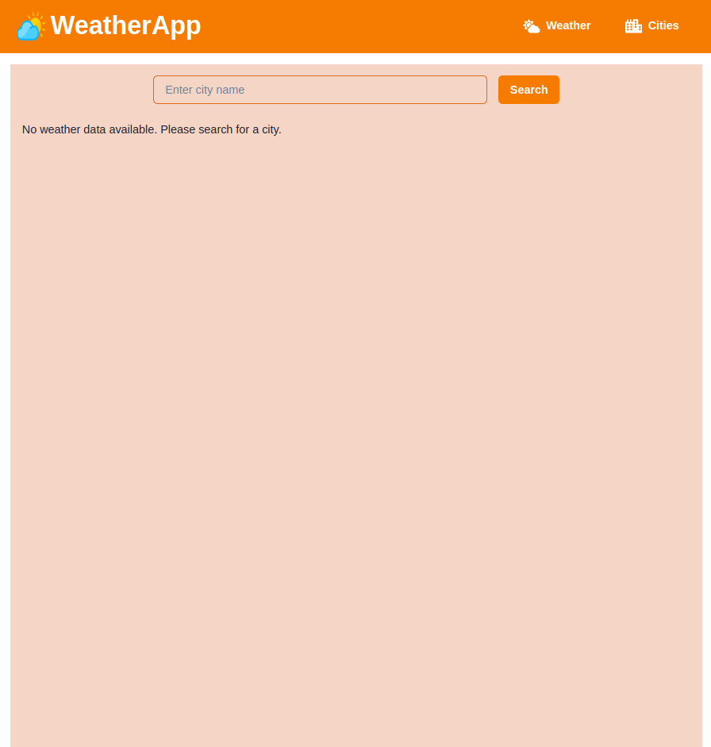
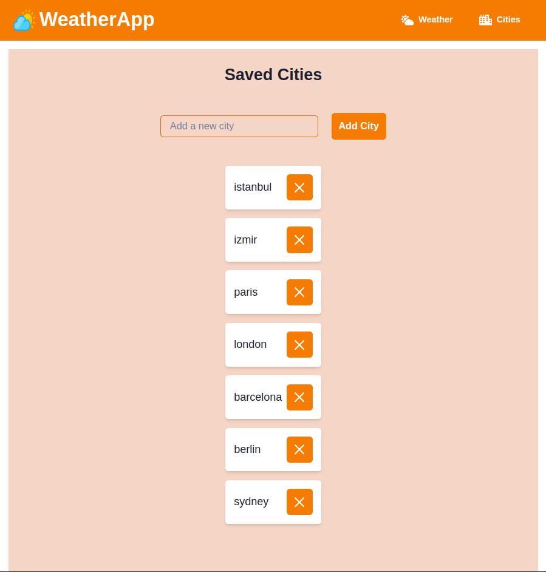
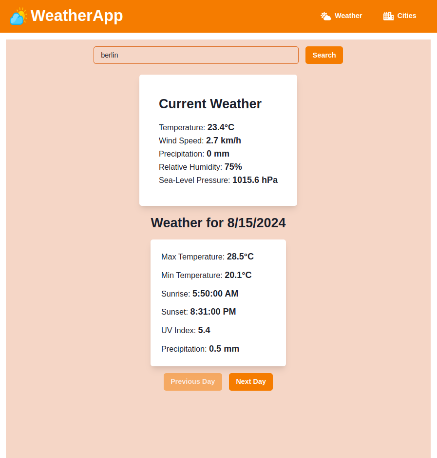

# WeatherApp ☀️

<p align="center">
  
</p>

<p align="center">
  A sleek, responsive, and feature-rich weather application built with React, Chakra UI, and Framer Motion.
</p>

---

WeatherApp provides current weather conditions and multi-day forecasts for cities worldwide. It leverages the power of the Open-Meteo API for detailed weather data and the Nominatim API for accurate city geocoding. Users can search for any city, view its current weather and daily forecast, and manage a list of their favorite cities for quick access.

## ✨ Screenshots

Here's a glimpse of the WeatherApp in action:

**Main Weather View:**

<br>
_Displays the current weather conditions and the multi-day forecast for the searched or selected city._

<br>

**Cities Management Page:**

<br>
_Allows users to add new favorite cities, view their saved list, and remove cities._

<br>

**Daily Forecast Detail:**

<br>
_Shows detailed weather information for a specific forecast day, navigable using the "Previous/Next Day" buttons._

## 🚀 Key Features

- **Global City Search:** Find weather data for any city using the Nominatim API for geocoding.
- **Current Weather Details:** Displays real-time temperature, wind speed, precipitation, relative humidity, and sea-level pressure.
- **Daily Forecast:** Provides a multi-day forecast including maximum/minimum temperatures, sunrise/sunset times, maximum UV index, and total daily precipitation.
- **Forecast Navigation:** Easily browse through forecast days using intuitive "Previous Day" and "Next Day" buttons.
- **Saved Cities Management:**
  - Add cities to a personalized list stored locally.
  - View all saved cities on a dedicated page.
  - Remove cities from the list with a single click.
- **Quick Access:** Click on a saved city to instantly load its weather forecast on the main page.
- **Responsive Design:** Fully responsive layout adapting seamlessly to desktop, tablet, and mobile screens using Chakra UI's responsive utilities.
- **Engaging UI/UX:**
  - Smooth page transitions and card animations powered by Framer Motion.
  - Subtle "shake" animations on interaction for visual feedback.
  - Loading spinners and informative toast notifications for user actions (add/remove city, errors).
- **Custom Theming:** Utilizes Chakra UI's theming capabilities with a distinct orange-based brand color palette.

## 🛠️ Technology Stack

- **Frontend Library:** [React.js](https://reactjs.org/)
- **UI Framework:** [Chakra UI](https://chakra-ui.com/)
- **Routing:** [React Router DOM](https://reactrouter.com/)
- **Animations:** [Framer Motion](https://www.framer.com/motion/)
- **Styling:** CSS-in-JS (via Chakra UI), CSS Modules/Global CSS (`index.css`)
- **Language:** JavaScript

## ☁️ APIs Used

- **Weather Data:** [Open-Meteo API](https://open-meteo.com/) - Provides free, high-resolution weather forecasts.
- **Geocoding:** [Nominatim API](https://nominatim.openstreetmap.org/) (powered by OpenStreetMap) - Converts city names into geographical coordinates (latitude/longitude).

## ⚙️ Getting Started

Follow these instructions to get a copy of the project up and running on your local machine for development and testing purposes.

### Prerequisites

- Node.js (v14 or later recommended)
- npm or yarn package manager

### Installation

1.  **Clone the repository:**

    ```bash
    git clone https://github.com/Mordris/weather-app.git # Replace with your repo URL
    cd weather-app
    ```

2.  **Install dependencies:**
    Choose one of the following commands based on your package manager:

    ```bash
    npm install
    ```

    or

    ```bash
    yarn install
    ```

3.  **Run the development server:**
    ```bash
    npm start
    ```
    or
    ```bash
    yarn start
    ```
    This will start the React development server, and the application should automatically open in your default web browser at `http://localhost:3000`.

### Building for Production

To create an optimized production build:

```bash
npm run build
```

or

```bash
yarn build
```

This command bundles the app into static files for production deployment in the build/ directory.
🧭 Usage
Search for a City: On the main "Weather" page, enter a city name in the search bar and click the "Search" button.
View Weather: The current weather conditions and the forecast for the first available day will be displayed.
Navigate Forecast: Use the "Previous Day" and "Next Day" buttons below the daily forecast card to cycle through the available forecast days.
Manage Saved Cities:
Click the "Cities" button in the header/app bar.
Enter a city name in the input field and click "Add City" to save it to your list.
To remove a city, click the red 'X' (CloseIcon) button next to its name.
Clicking on any city name in the list will automatically navigate you back to the "Weather" page and display its forecast.

Enjoy checking the weather with WeatherApp!
